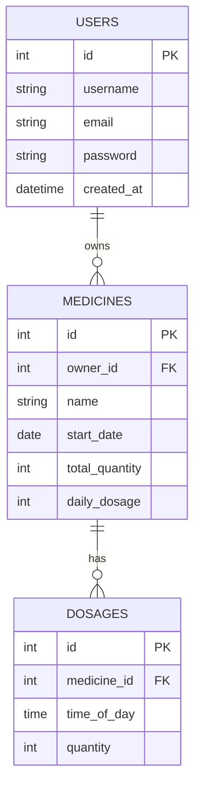

# ERDiagram(Mermaid) for MedicineTracker

```mermaid
    erDiagram
    USERS ||--o{ MEDICINES : owns
    MEDICINES ||--o{ DOSAGES : has

    USERS {
        int id PK
        string username
        string email
        string password
        datetime created_at
    }

    MEDICINES {
        int id PK
        int owner_id FK
        string name
        date start_date
        int total_quantity
        int daily_dosage
    }

    DOSAGES {
        int id PK
        int medicine_id FK
        time time_of_day
        int quantity
    }

```
